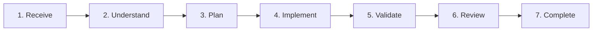

# Standard Execution Workflow

## Purpose

This document defines the standard execution workflow for every engineering task.

Every contributor — whether human or AI agent (ChatGPT, Codex, Claude, Gemini, Antigravity, Cursor, etc.) — must follow the same structured process.

**Skipping workflow steps is a process violation.**

---

## Workflow Overview

---

## Phase 1 — Receive

**Objective:** Understand what is being requested before taking action.

**Actions:**
- Read the assigned task thoroughly.
- Identify the core goal.
- Identify expected deliverables and outputs.
- Identify dependencies, blockers, and constraints.

**Exit Criteria:** The task scope, objectives, and constraints are fully understood.

---

## Phase 2 — Understand

**Objective:** Understand the project, domain, and existing codebase before planning or making changes.

**Required Reading & Inspection:**
- AI Constitution
- Project Principles & Architecture Docs
- Related Architectural Decision Records (ADRs)
- Domain boundaries & data schemas
- 3–5 representative code files matching the target stack

**Exit Criteria:** The contributor understands the business context, domain invariants, and existing conventions.

---

## Phase 3 — Plan

**Objective:** Design and bound the solution before writing implementation code.

**Actions:**
- Define the technical approach and boundary impact.
- Identify all affected files and packages.
- Check for existing reusable solutions and primitives.
- Validate the design against the architecture rules.
- Break down into atomic, reviewable tasks.

**Exit Criteria:** Implementation plan is clear, bounded, and approved.

---

## Phase 4 — Implement

**Objective:** Execute the planned work cleanly and conservatively.

**Rules:**
- Implement only what the task requests (the smallest correct change).
- Match the codebase's existing naming, typing, and formatting style.
- Keep responsibilities in their owning layers.
- Avoid speculative features, premature abstractions, or unrelated refactoring.
- Keep changes atomic and bisectable.

**Exit Criteria:** Requested functionality is completely implemented without collateral scope creep.

---

## Phase 5 — Validate

**Objective:** Verify correctness with real evidence.

**Checklist:**
- [ ] Architecture and layer boundaries respected
- [ ] Project Principles and Constitution respected
- [ ] Documentation updated to reflect changes
- [ ] Naming and typing consistent with codebase
- [ ] No duplicated logic or stray abstractions
- [ ] Build passes cleanly without warnings/errors
- [ ] Unit, integration, and boundary tests pass

**Exit Criteria:** Implementation is fully tested and production-ready with evidentiary proof.

---

## Phase 6 — Review

**Objective:** Objectively evaluate quality and maintainability before closing the task.

**Review Questions:**
1. Did we solve the correct problem?
2. Did we follow the documented architecture?
3. Can another engineer understand this in six months?
4. Did we leave the project better?

**Exit Criteria:** Code and architecture review criteria are satisfied with zero unaddressed regressions.

---

## Phase 7 — Complete

**Objective:** Close the task with clean documentation and artifacts.

**Actions:**
- Update task status and changelogs.
- Update related documentation, specs, and schemas.
- Record new architectural decisions (ADR) if structural patterns changed.
- Prepare a clean, descriptive, atomic commit.

**Exit Criteria:** Task is officially Done and reproducible.
