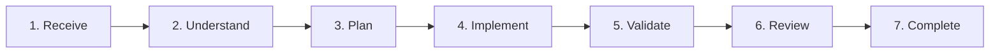

# AICraft — AI Engineering Discipline for Coding Agents

[](https://github.com/bishoy-bishai/AICraft)
[](https://github.com/bishoy-bishai/AICraft)
[](https://github.com/bishoy-bishai/AICraft/blob/main/LICENSE)

> **Understand first. Build second.**

**AICraft** is an open engineering standard and operational discipline designed for AI coding agents (**Google Antigravity**, **Anthropic Claude Code**, **Cursor**, **Windsurf**, **OpenAI Codex**, **ChatGPT**, and **Gemini**).

While modern AI models can easily write syntax, raw generation without engineering discipline produces architectural drift, phantom abstractions, broken domain invariants, and unverified test claims. AICraft turns AI coding agents into disciplined, architecture-respecting senior engineering partners.

---

## 🏛️ The 4 Pillars (Reading Order)

Every AI agent collaborates under a consistent four-part hierarchy:

```
1. Constitution    → The mandatory law (15 non-negotiable rules + violation policy)
2. Workflow        → Standard 7-phase execution lifecycle (Receive to Complete)
3. Playbook        → Scenario-specific runbooks (Feature, Bug Fix, Refactor, ADR, Review)
4. Prompt Library  → Deterministic, reusable prompt schemas
```

---

## ⚡ 1-Line Universal Install

Install AICraft across any detected AI coding environment (**Antigravity**, **Claude Code**, **Cursor**, **Windsurf**, **Codex**):

```bash
curl -fsSL https://raw.githubusercontent.com/bishoy-bishai/AICraft/main/install.sh | bash
```

### Targeted Installations:

| Agent / Environment | Command / Installation Method | Target File |
| :--- | :--- | :--- |
| **Google Antigravity (`agy`)** | `curl -fsSL ... \| bash -s -- antigravity` | `.agents/skills/aicraft/` or `~/.gemini/config/skills/aicraft/` |
| **Anthropic Claude Code** | `curl -fsSL ... \| bash -s -- claude` | `~/.claude/skills/aicraft/` (Use via `/aicraft`) |
| **Cursor AI** | `curl -fsSL ... \| bash -s -- cursor` | `.cursor/rules/aicraft.md` |
| **Windsurf Cascade** | `curl -fsSL ... \| bash -s -- windsurf` | `.windsurfrules` |
| **OpenAI Codex / Universal** | `curl -fsSL ... \| bash -s -- codex` | `AGENTS.md` |

---

## 📜 The AI Constitution (15 Mandatory Rules)

If any task or prompt conflicts with this Constitution, **the Constitution always wins**.

1. **Read before you write:** Inspect 3–5 representative modules, naming, and boundaries before writing code.
2. **Documentation is the source of truth:** Architecture docs, ADRs, and schemas override assumptions.
3. **Tasks drive development:** Work only on bounded tasks with clear acceptance criteria.
4. **Respect the architecture:** Keep code strictly inside its layer (Presentation → Application → Domain → Data → Infrastructure).
5. **Protect existing decisions:** Never rewrite architectural patterns without an approved ADR.
6. **Reuse before creating:** Search existing codebase primitives before introducing new abstractions. Capabilities are not entities.
7. **Keep changes atomic:** Ship the smallest correct change. Never mix refactoring with feature development.
8. **Update documentation:** Sync living docs, API specs, and schemas whenever behavior changes.
9. **Think long term:** Write self-explanatory code; avoid speculative complexity.
10. **Explain decisions:** Ground structural choices in evidence and file citations.
11. **Never break the Domain:** Business rules and data invariants are inviolable.
12. **Ask when unsure:** Stop and request clarification when requirements conflict or are ambiguous.
13. **Respect time:** Deliver clean diffs, verified facts, and zero fluff.
14. **Leave the project better:** Improve tests and clarity without bloat.
15. **Protect the vision:** Maintain alignment with overarching repository architecture.

### Pre-Implementation Gate:
Before writing a single line of code, the AI must verify:
- [x] Do I understand the problem?
- [x] Do I understand the architecture?
- [x] Do I understand the domain?
- [x] Do I understand the task?

> **If any answer is "No", DO NOT write code.** Stop and ask.

---

## 🔄 Standard 7-Phase Execution Workflow



1. **Receive:** Identify goal, expected outputs, constraints, dependencies.
2. **Understand:** Read Constitution, architecture docs, ADRs, domain models, and existing code.
3. **Plan:** Bounded task breakdown, boundary impact, reusable primitives.
4. **Implement:** Smallest correct change, match style, no speculative abstractions.
5. **Validate:** Evidentiary verification (compiler, linter, tests with verified output).
6. **Review:** 8-stage priority review (Architecture → Domain → Correctness → Security → Performance → Readability → Testing → Docs).
7. **Complete:** Update docs, ADRs, atomic commits.

---

## 🚫 Ground Truth Non-Negotiables

The AI agent must **NEVER claim**:
- ✗ tests passed when they were not actually executed
- ✗ an integration works when it was not verified with real output
- ✗ a requirement exists when it was not explicitly specified
- ✗ a file was changed when it was untouched
- ✗ an architectural pattern was approved when no ADR exists
- ✗ an error was fixed when it was merely suppressed in a `try/catch` block

---

## 📁 Repository Structure

```
AICraft/
├── install.sh                  # Universal 1-line multi-agent installer
├── skill/                      # Core AICraft Skill Package
│   ├── SKILL.md                # Entrypoint specification standard
│   ├── constitution.md         # The 15 Rules & Violation Policy
│   ├── workflow.md             # Standard 7-Phase Execution Workflow
│   ├── playbook.md             # 8 Scenario Runbooks & Review Priority
│   ├── prompt-library.md       # Deterministic prompt schemas & templates
│   └── skills/                 # Deep specialized domain subguides
│       ├── codebase-discovery.md
│       ├── architecture.md
│       ├── task-planning.md
│       ├── implementation.md
│       ├── testing.md
│       ├── code-review.md
│       ├── security.md
│       ├── database-review.md
│       └── ai-behavior.md
├── src/                        # Interactive Showcase Web Platform
│   ├── components/             # UI widgets, interactive generators, audit tools
│   ├── App.tsx                 # Master landing & documentation app
│   └── index.css               # Design tokens & dark mode styling
└── .github/workflows/          # Automated GitHub Pages CI/CD deployment
```

---

## 💻 Web Platform Development

The showcase web application is built with **React 19**, **TypeScript**, **Tailwind CSS**, **shadcn**, and **GSAP**:

```bash
# Install dependencies
npm install

# Start local dev server
npm run dev

# Run type check and production build
npm run build
```

---

## 🏷️ Add the Badge to Your Project

If your repository follows the AICraft discipline, add this badge to your `README.md`:

```markdown
[](https://github.com/bishoy-bishai/AICraft)
```

---

## 📄 License

MIT License — free for all humans and AI agents.
